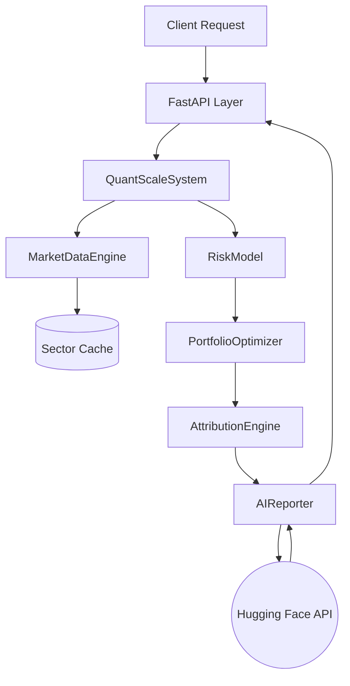

# QuantScale AI: Automated Direct Indexing & Attribution Engine

**QuantScale AI** is an institutional-grade portfolio optimization engine designed to replicate the "Direct Indexing" capabilities of top asset managers (e.g., Goldman Sachs, BlackRock). 

[](https://huggingface.co/spaces/AJAYKASU/QuantScaleAI)
[](https://ajaykasu-quantscaleai.hf.space/docs)

It specifically addresses the challenge of **Personalized Indexing at Scale**: allowing 60,000+ client portfolios to track a benchmark (S&P 500) while accommodating specific constraints (Values-based exclusions like "No Energy") and providing automated, high-precision performance attribution.

---

## Key Features

### 1. Quantitative Engine (The Math)
- **Tracking Error Minimization**: Uses `cvxpy` to solve the quadratic programming problem of minimizing active risk.
- **Robust Risk Modeling**: Implements **Ledoit-Wolf Covariance Shrinkage** to handle the "High Dimensionality, Low Sample Size" problem inherent in 500-stock correlation matrices.
- **Direct Indexing**: Optimizes individual stock weights rather than ETFs, enabling granular customization.

### 2. Wealth Management Features
- **Tax-Loss Harvesting**: Automated identification of loss lots with **Wash Sale Proxy logic**. 
    - *Example*: Detects a loss in Chevron (CVX) -> Suggests swap to Exxon (XOM) to maintain Energy exposure without triggering wash sale rules.
- **Sector Caching**: Local caching layer to handle API rate limits and ensure low-latency performance for demos.

### 3. AI Integration (Generation Alpha)
- **Attribution Precision**: Uses the **Brinson-Fachler Attribution Model** to decompose excess return into **Allocation Effect** (Sector weighting) and **Selection Effect** (Stock picking).
- **Hugging Face Integration**: Feeds high-signal attribution data (Top 5 Contributors/Detractors) into `Meta-Llama-3-8B-Instruct` to generate profound, natural language client commentaries.

---

## Mathematical Formulation

The core optimizer solves the following Quadratic Program:

$$
\min_{w} \quad (w - w_b)^T \Sigma (w - w_b)
$$

**Subject to:**

$$
\sum_{i=1}^{N} w_i = 1 \quad (\text{Fully Invested})
$$

$$
w_i \ge 0 \quad (\text{Long Only})
$$

$$
w_{excluded} = 0 \quad (\text{Sector Constraints})
$$

Where:
- $w$ is the vector of portfolio weights.
- $w_b$ is the vector of benchmark weights.
- $\Sigma$ is the Ledoit-Wolf shrunk covariance matrix.

---

## Tech Stack
- **Languages**: Python 3.10+
- **Optimization**: `cvxpy`, `scikit-learn` (Ledoit-Wolf)
- **Data**: `yfinance` (Market Data), `pandas`, `numpy`
- **AI/LLM**: `huggingface_hub` (Inference API)
- **API**: `FastAPI` (Async REST Endpoints)
- **Architecture**: Object-Oriented (Abstract Managers, Pydantic Schemas)

---

## Installation & Usage

1. **Clone & Install**
```bash
git clone https://github.com/AjayKasu1/QuantScaleAI.git
pip install -r requirements.txt
```

2. **Configure Credentials**
Rename `.env.example` to `.env` and add your Hugging Face Token:
```env
HF_TOKEN=hf_...
```

3. **Run the API**
```bash
uvicorn api.app:app --reload
```
POST to `http://127.0.0.1:8000/optimize` with:
```json
{
  "client_id": "CLIENT_01",
  "excluded_sectors": ["Energy"]
}
```

---

## Architecture


