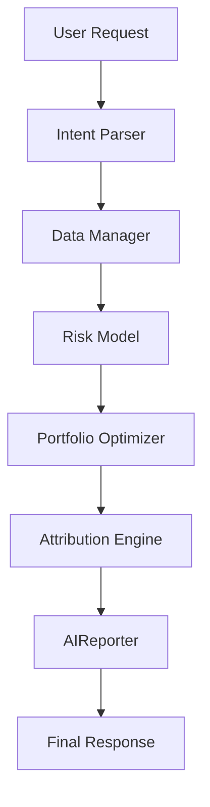

# The Pipeline Flow

When a user requests a portfolio generation, the state flows top-to-bottom through the `QuantScaleSystem.run_pipeline` method located in `main.py`.

## Step-by-Step Flow

1.  **Request Intake**: The user submits a natural-language prompt or direct JSON payload to the FastAPI/Streamlit frontend.
2.  **Intent Parsing**: The `AIReporter` invokes a strict LLM prompt to map the text to exact GICS sectors or stock tickers.
3.  **Data Hydration**: The `DataManager` fetches historical adjusted close prices (via `yfinance` or synthetic fallback) and maps assets to their respective sectors.
4.  **Risk Modeling**: The `RiskModel` calculates a shrunk covariance matrix of historical returns.
5.  **Optimization**: The `PortfolioOptimizer` takes the covariance matrix, benchmark weights, and constraints, executing a quadratic program to find the optimal active weights.
6.  **Attribution**: The `AttributionEngine` calculates the realized (or projected) active return, breaking it down into Allocation and Selection effects, and outputs a strict JSON Truth Table.
7.  **Narrative Generation**: The `AIReporter` reads the Truth Table and produces a professional summary of the portfolio's deviations and performance.

